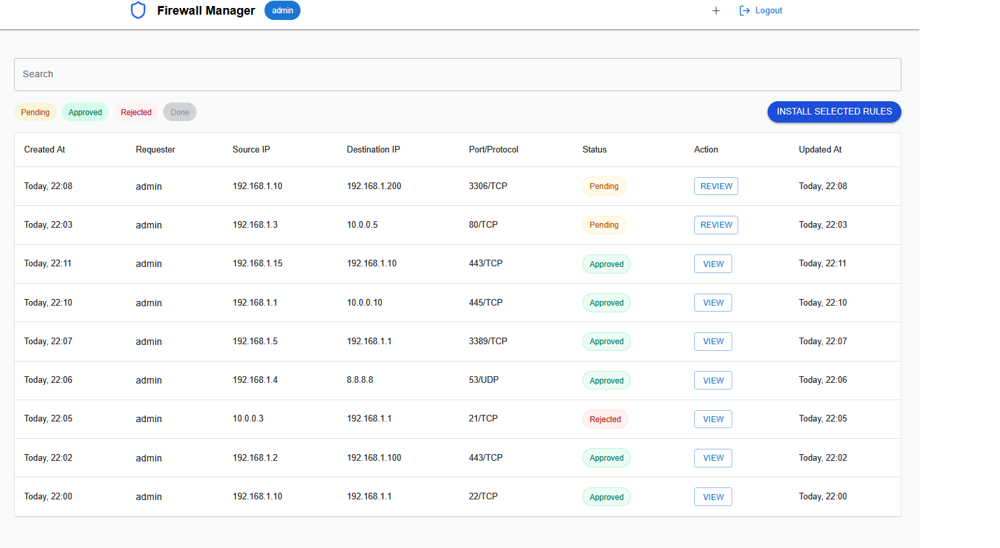

# Firewall Manager



> **Open Source Notice**  
> This project is open source, but **commercial/business use is not permitted** without prior written agreement from the author.

## Overview

Firewall Manager is a web-based tool for managing firewall rule requests. It enables you to:

- **Create** new firewall rule requests.
- **Review** and **approve/reject** pending requests.
- **Install** approved rules directly to your firewall (after proper backend configuration).

The screenshot above shows the intuitive dashboard where administrators can filter and review rule requests.

---

## Features

- **User-friendly Dashboard:**  
  Easily filter and search requests by status, IP addresses, ports, or requester names.

- **Role-Based Access:**  
  Administrators can review, approve/reject, and install rules, while regular users can submit requests.

- **Customizable Firewall Integration:**  
  Integrate with your specific firewall by modifying the backend logic in `install.js`.

---

## Important Notes

1. **DEVMODE:**  
   - Developer mode is enabled by default for local development and debugging.
   - **For production, disable DEVMODE** by setting `DEVMODE=false` via environment variables.

2. **Firewall Integration:**  
   - To connect to your firewall API, configure the backend file **`install.js`** with the appropriate commands and API calls matching your firewall's requirements.

3. **License & Usage:**  
   - This project is open source for personal and non-commercial use only.
   - **Business or commercial use is prohibited** without an explicit agreement with the author.

---

## Environment Variables

Create a `.env` file in your backend directory with the following variables:

```ini
PORT=3001
JWT_SECRET=your_secret_key
LDAP_URL=ldap://ldap.example.org
LDAP_BASE_DN=DC=example,DC=org
LDAP_DOMAIN_SUFFIX=@example.org
LDAP_ADMIN_GROUP=GROUPNAMEXAMPLE
DEVMODE=true
```

These variables control the server port, JWT token secret, LDAP configuration, and the developer mode status. Remember to disable DEVMODE for production.

Getting Started

    Clone the Repository:

git clone https://github.com/your-org/firewall-manager.git
cd firewall-manager

Install Dependencies:

# In the frontend directory:
npm install

# In the backend directory:
npm install

Configure Environment Variables:
Create a .env file in your backend directory with the variables listed above.

Run the Application:

    # Frontend:
    npm start

    # Backend:
    npm run dev

    The application should now be accessible in your browser (e.g., at http://localhost:3000).

Firewall Installation Logic

To integrate with your firewall, open install.js in the backend and update it to match your firewall's API or CLI requirements. Replace any placeholder commands or API calls with the ones that fit your environment. Ensure that any sensitive credentials are securely managed.
Contributing

Contributions are welcome! To contribute:

    Fork the repository.

    Create a feature branch:

git checkout -b my-new-feature

Commit your changes:

git commit -am 'Add new feature'

Push to the branch:

    git push origin my-new-feature

    Open a Pull Request.

Note: While this project is open source, commercial use is strictly prohibited without a direct agreement with the author.
Contact

For inquiries, feature requests, or permission for commercial usage, please contact the project owner or open an issue in the repository.

Enjoy using Firewall Manager—and remember to disable DEVMODE in production!